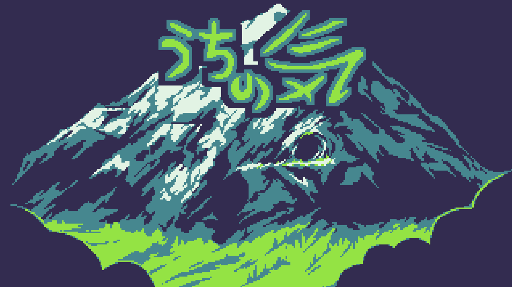

# Uchi no Ki

**Play now:** https://voithos.itch.io/uchi-no-ki

In Uchi no Ki, you play the role of an astral monk seeking truth. To find it,
you'll need to traverse the interior of the holy mountain, and utilize your Ki
to solve any obstacles you encounter.

Strength of spirit, solid of mind.

## About

Uchi no Ki was made solo for the GMTK Game Jam 2021, which had the theme
"Joined Together", and then refined later into a post-jam release.

## License

The game code (but not the assets) is licensed under the MIT license.
